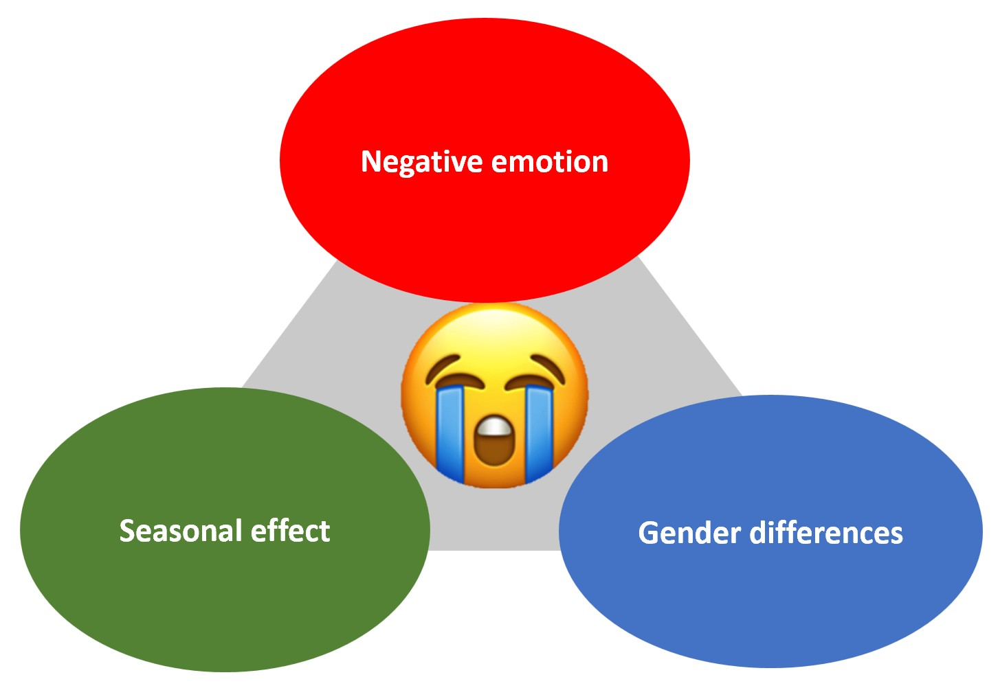

Throughout the decade, depression has become a common mental disorder worldwide with a growing of affected population. As indicated by WHO, approximately 3.8% of population, 280 million, suffered from depression. Among all, 10.7% of adults and 15% of young people has reported depressive emotion, with 70% of them take anxiety and depression as their major problems in US. 

As depression is one of the priority conditions covered by WHO for its severeness and high prevalence rate, we would like to focus our research on analysis of the potential factors that affect depression.

## How can we tell the depression?
A growing body of evidence shows that people with depression use language differently. Many studies have unveiled a class of words that can help accurately predict whether someone is suffering from depression. The most robust language marker of depression is the frequency of using first-person singular pronouns, such as I and my. Moreover, specific negative descriptors are linked to the tendency of depression.

Under this context, we have applied **sentiment analysis** to automatically sort text data from Quotebank by positive, negative, and neutral sentiments. The further goals of our project are the following, also shown in Fig.1.
1. Analyze the trend of negative experience
2. Analyze the seasonal effect on negative emotions
3. Analyze gender effect on negative emotions

## Method
To look into this topic, we analyzed the dataset from [Quotebank](./another-page.html), which is a corpus of quotations from a decade of news. We mainly focused on the data from 2017 to 2020, since the data in 2016 is not equally distributed in each month and in 2020, it only covers until April. In this project, we applied two libraries, **[TextBlob](https://pypi.org/project/textblob/0.9.0/)** and **[gender-guesser](https://pypi.org/project/gender-guesser/)**, to analyze the dataset. 

TextBlob is a Python library for prossing textual data, is useful for sentiment analysis by a pre-defined dictionary classifying negative and positive words. TextBlob assigns a score, between [-1, 1] to each word in a sentence, then by operations, for example, multipys and takes average, to get the final results. TextBlob returns polarity and subjectivity of a sentence which we can further analyze. Gender-guesser predicts the gender of a given first name with six different output: unknown (name not found), andy (androgynous), male, female, mostly_male, or mostly_female. In our project, we take male and mostly_male as man, female and mostly_female as women, while discard the data that gives output as unknown and andy.

For all the analysis, we randomlly collect 1 million quotes from 2017, 2018, and 2019 for 30 times to decrease bais and variation. A 
schematic diagram of our analysis process is shown in Fig.2 and the detailed analytic methods are describled in the [Github](./another-page.html).

## Our Discoveries
### A Growing Trend of Negative Emotion 
In addition to the growing population that suffers from depression, a survey from [Gallup Analytics](https://hcabarbieri.it/2021/07/21/2020-was-the-year-of-negative-emotions-poll-finds/) also pointed out that the negative experience index has been increasing year by year from 2015 to 2020. With the Quotebank dataset from 2015 to 2019, we tried to reproduce and look into this phenomenon deeper with both negative words and polarity analysis.

According to our analysis of negative words over years, we found that from 2015 to 2019 (not counting 2016, ), in general, the negative count increases year by year.
Our analysis results based on quotebank data are consistent with the survey from Gallup Analytics.

According to our analysis of negative words over years, we found that from 2015 to 2019 (not counting 2016, because the number of quote numbers in 2016 is extremely uneven over months), in general, the negative count increases year by year. Although the error bar of each year overlaps

### Seasonal Effect
##### What is SAD?
Seasonal affective disorder (SAD) is a type of depression that's related to changes in seasons —symptoms start in the fall and continue into the winter months, sapping your energy and making you feel moody. These symptoms often resolve during the spring and summer months
##### Cause
- Neurotransmitter regulation issues: People with SAD may have trouble regulating serotonin
- Melatonin Overproduction: Darkness increases production of melatonin, which regulates sleep. As winter days become shorter, melatonin production increases, leaving people with SAD to feel sleepier and more lethargic, often with delayed circadian rhythms.
- Vitamin D Underproduction: People with SAD also may produce less Vitamin D, which is believed to help with serotonin activity.
- SAD and other forms of depression is exercise and physical activity, but these may be difficult to instigate due to lack of motivation and the cold temperatures in the winter.

.png)

### Gender Effect
**Women are more prone to depression and moody swings.** So we want to identify these 2 phenomenon by calculating the female group’s 
- variation of sentiment polarity over time 
- mean of sentiment polarity over time 
And compare the results with the parameters in male group.

## Conclusions

### Reference
